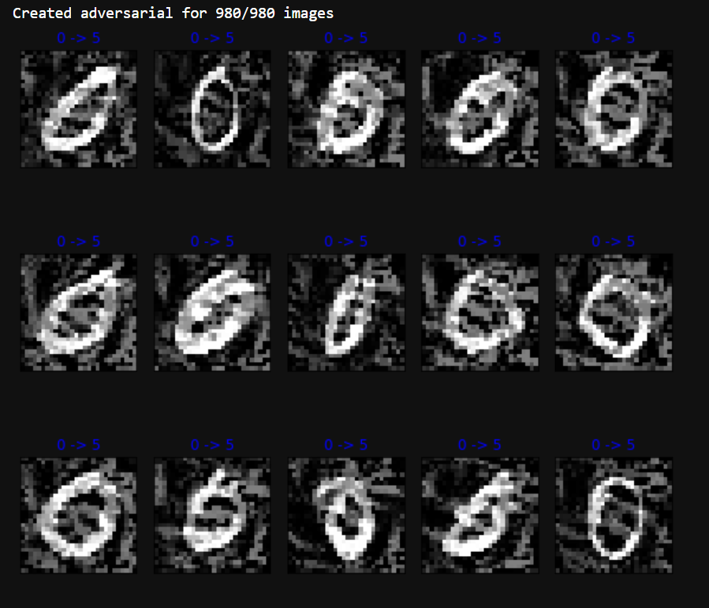

# TargetedAdversarialFGSM
Fast Gradient Sign Attack (FGSA) targeting specific misclassification outputs.
Set a targeted number to have the model misclassify to.

```python
fgsm = FGSM(orinal_num=0, target_num=5)
fgsm.start_fgsa()
fgsm.display_results()
```
</br>
<p align="center">
  
  <p align="center"><i>Adversarial output images</i></p>
</p>
